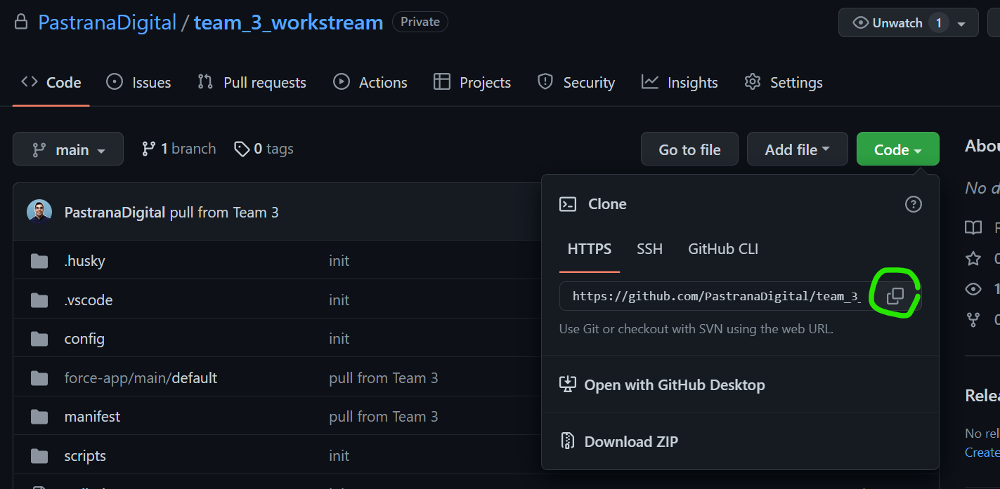
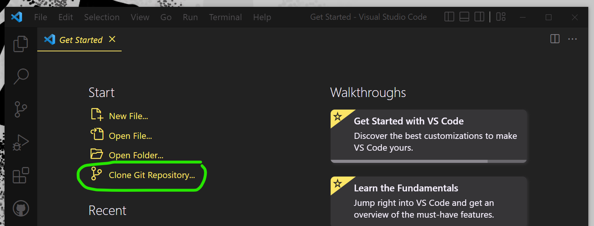
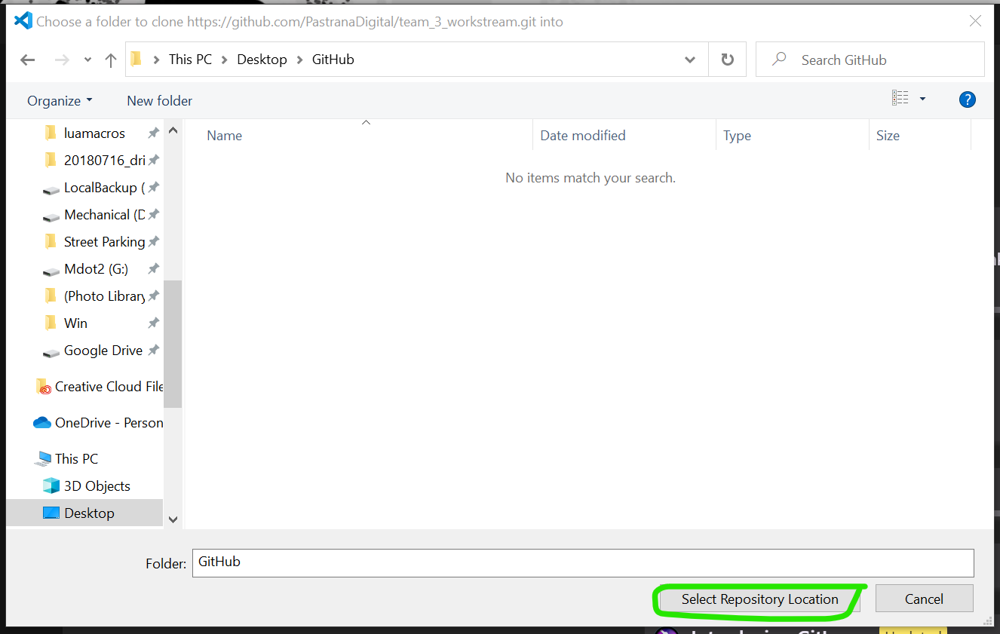
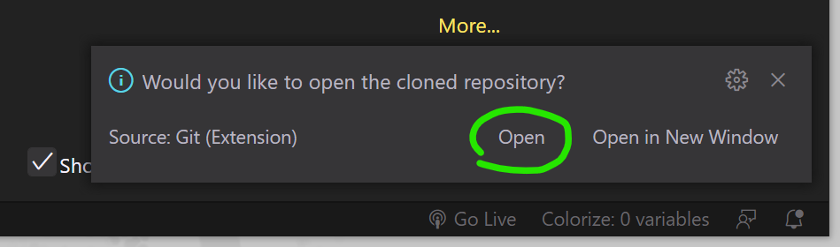

## 💾 Clone the repository (only do this once)

## Prerequisites

Make sure you have these installed and confirmed

-   Git [Install Link](https://git-scm.com/downloads)
-   Nodejs >= 16 [Install Link](https://nodejs.org/en/download/)
-   Cumulus CI & Python [Install Link](https://cumulusci.readthedocs.io/en/latest/get-started.html)
    -   Python >= 3.8
    -   pipx >= 1.1.0
    -   Cumulus CLI >= 3.71
-   SFDX CLI >= 7.185 [Install Link](https://developer.salesforce.com/docs/atlas.en-us.sfdx_setup.meta/sfdx_setup/sfdx_setup_install_cli.htm)
-   VSCode [Install Link](https://user-images.githubusercontent.com/53458320/219748773-dd6cc301-ad15-4725-8936-6feb867ef55c.png)
    -   You will also need the `Salesforce Extension Pack (Expanded)` installed.
        <br>
        <br>Once installed, reload your VSCode by closing it and reopening it
        <br><br>

Run these commands in a Git Bash Terminal. These commands should be found in your path, and you can check the version using the --version argument.

```bash
node --version
python --version
pipx --version
sfdx --version
cci --version
```

<br><br>

<br><a href="https://youtu.be/3aDylzlL6WI"><br>
Set Up VSCode & Clone a Repo - YouTube Video Link</a>

<br>

1. Obtain the appropriate URL from the GitHub repo
   <br><br>

<br>

2. In VSCode, Clone Git Repository and paste the URL link
   <br><br>

<br>

3. Create a parent directory for the project (e.g. Desktop/GitHub)
   <br><br>

... _several minutes later_ ...

<br>

4. Open your new directory
   <br><br>

<br><br><br><br>
Return to Main [README.md](../README.md)
