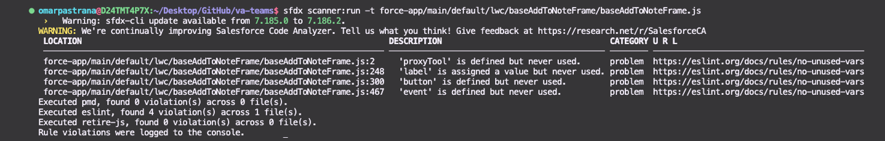

  

# Code Scanning on Your Machine

This is important for all developers working with Apex, LWCs or Aura components.

After you have done the `va-teams` repo on your machine in VSCode, follow these steps to get Code Scan started

   

## 🔩 Setup and Install the tools

1. Check to see if you have the `node_modules` folder. Depending on that, the next step will either install or update your files
     

2. Run `npm install` in your VSCode terminal. This will pull all the tool dependencies from the package.json file into your project. This may take a little while to do the first time.
     

3. If you didn't before, you should have a `node_modules` folder.

4. Run `sfdx plugins` in your VSCode terminal

    - `@salesforce/sfdx-scanner` should appear
        
    - if it doesn't, install by running `sfdx plugins:install @salesforce/sfdx-scanner` in your VSCode terminal

5. Now you can run all the scan commands in the package.json by typing `npm run scan:all` for example
     

  

## 🔍 Scan a specific file

1. Open the file you want scanned in VSCode

2. Right click on the tab and select `Copy Relative Path`
     

3. Now you will need to build a command. Type `sfdx scanner:run -t` in your VSCode terminal, put a space, then paste the copied relative path from the previous step. Now press enter to run that command

    - it should look something like this  
      `sfdx scanner:run -t force-app/main/default/lwc/baseAddToNoteFrame/baseAddToNoteFrame.js`
    - the `-t` is the target area you want the scanner to check. This can be a file or a folder

  

## 📖 Reading the Results

  

These are the results from my scan. It has the `Location` section and the `URL` section.  
By holding down the `Control` button and clicking on these it will open them up for further inspection.

1. Read the URL documentation to get help on what to fix for each line

2. Fix these items one by one

3. Once all are fixed, run the scan again to check your status

4. If all are cleared, then commit these changes and continue your work

  

## Resources

Salesforce Code Analyzer
https://forcedotcom.github.io/sfdx-scanner/en/v3.x/getting-started/install/
