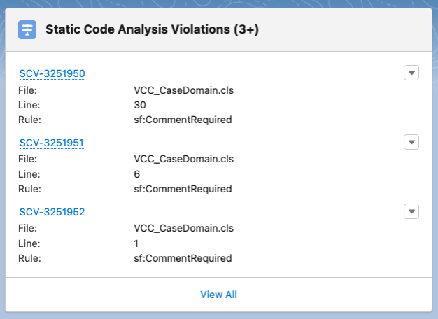

# 🩻 Copado - Static Code Analysis for Apex

## Check Apex Classes in Your Copado Story

On a user story with an environment inside a pipeline that has SCA settings assigned, you can request static code analysis for Apex classes related to it. To do this, navigate to the User Story record.

1. Click the drop-down menu at the top right corner. Then click `Run Static Code Analysis`
     

 

2. The request will then begin processing
     

 

3. Once it is completed (takes around 10 mins) click on the `Related` tab
     

 

4. Scroll down to the `Static Code Analysis Results` section & click on the hyperlinked record name (ex: SCA-000000)
     

 

5. This record gives an overview of the whole result. The `CodeScan Details` section is the best place to find information on the severity level at a quick glance
     

 

6. On the right side, the individual violations are shown. Click the `View All` link to open the full list
     

 

7. This list is very helpful for you to see the code class and lines that have violations. The `Rule` column briefly tells you the issue. The `Severity` column can be sorted to focus on the Critical ones first
     

 

8. By clicking on the individual records (ex: SCV-0000000) you can get more information on the rule, it’s priority and a link for more information.
     

  

## Copado Documentation:

-   [Run Static Code Analysis](https://docs.copado.com/articles/#!copado-ci-cd-publication/run-static-code-analysis)
-   [PMD Static Code Analysis Results](https://docs.copado.com/articles/#!copado-ci-cd-publication/pmd-sca-results)
