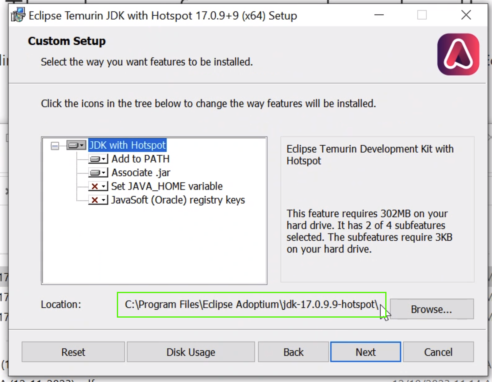
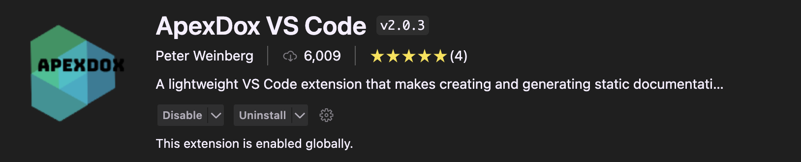
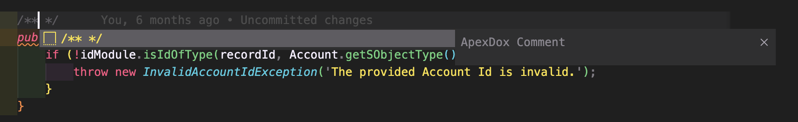
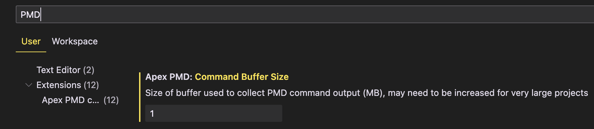
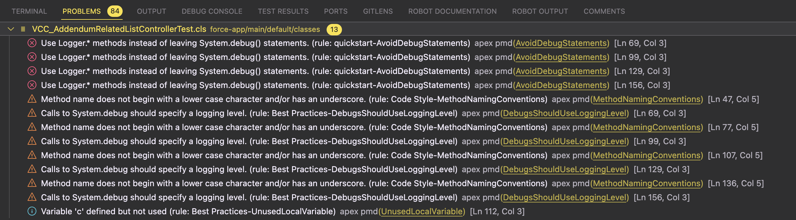
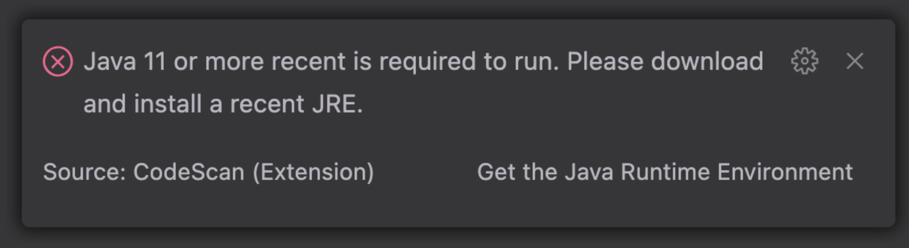
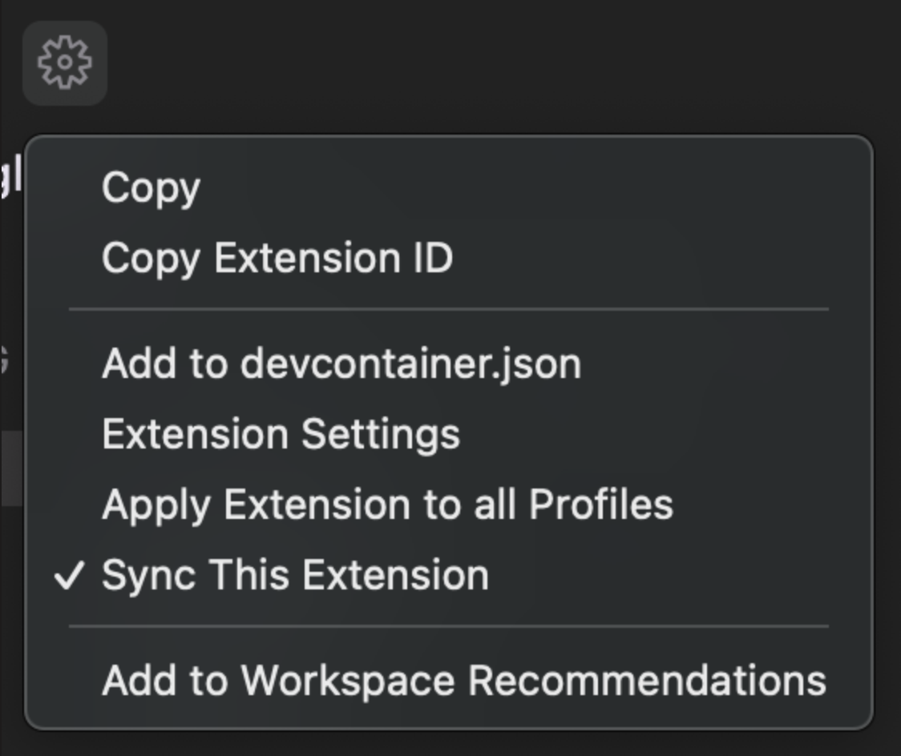

  

# PMD Static Source Code Analyzer

It finds common programming flaws like unused variables, empty catch blocks, unnecessary object creation, and so forth.
 

🏆 Objective: Increase the quality and consistency of our code earlier in the process

[PMD Homepage](https://pmd.github.io/)

  

## Install Java

1. Using the following link, download version `17` for your operating system  
   https://adoptium.net/temurin/releases/?os=any&arch=any&version=17
    

    - Windows users should choose the `.msi` JDK version
        

1. Once the download is complete, install the version `17`. Pay special attention to the location of the install, it will look something like this:  
   Mac: `/Library/Java/JavaVirtualMachines/temurin-17.jdk/Contents/Home`  
   Windows: `C:\Program Files\Eclipse Adoptium\jdk-17.0.9.9-hotspot\`  
     
    
1. Confirm you have successfully installed by running: `java -version`

  
  

## Install PMD & Other Extensions

1. Download the zip file from: https://github.com/pmd/pmd/releases#:~:text=pmd%2Ddist%2D7.0.0%2Drc4%2Dbin.zip
     
1. Unzip the file
     
1. Install the Apex Dox extension by Peter Weinberg: https://marketplace.visualstudio.com/items?itemName=PeterWeinberg.apexdox-vs-code
     
    <!--   -->
    - type `/**` and when prompted, press enter to enable the shortcut and populate a comment template
        
       
1. Install the Error Lens extension by Alexander: https://marketplace.visualstudio.com/items?itemName=usernamehw.errorlens
     
    
1. Install the Apex PMD extension by Charlie Jonas: https://marketplace.visualstudio.com/items?itemName=chuckjonas.apex-pmd
     
    
1. Open the settings menu `Ctrl/Cmd + ,` or `Ctrl + Shift + P` and enter "Open User Settings"
     
1. Enter "PMD" in the search bar to pull up all the options we need
     
    
1. Confirm these settings

-   "Apex PMD: Command Buffer Size" - enter `1`
-   "Apex PMD: Enable Cache" - Check the box
-   "Apex PMD: Jre Path" - Add the Java path from above ex: `/Library/Java/JavaVirtualMachines/temurin-17.jdk/Contents/Home`
-   "Apex PMD: Rulesets" - Add Item and enter `ruleset.xml`
-   "Apex PMD: Run On File Open" - Check the box

  
  

## Using PMD

1. When you save a file you may see these in the Problems tab
     
    
1. Repair and save the file to see the updated list
     
1. DO NOT suppress any warnings

  
  

## If Needed, Update Java settings in VSCode

Close and re-open VSCode. If you see messages like this, then follow these steps:
  

1. Click on the gear and select "Manage Extension"
     
1. On the extension page, click on the gear and select "Extension Settings"
     
    
1. Add the Java path from above ex: `/Library/Java/JavaVirtualMachines/temurin-17.jdk/Contents/Home`
     

  

[^ BACK TO TOP](#pmd-static-source-code-analyzer)
